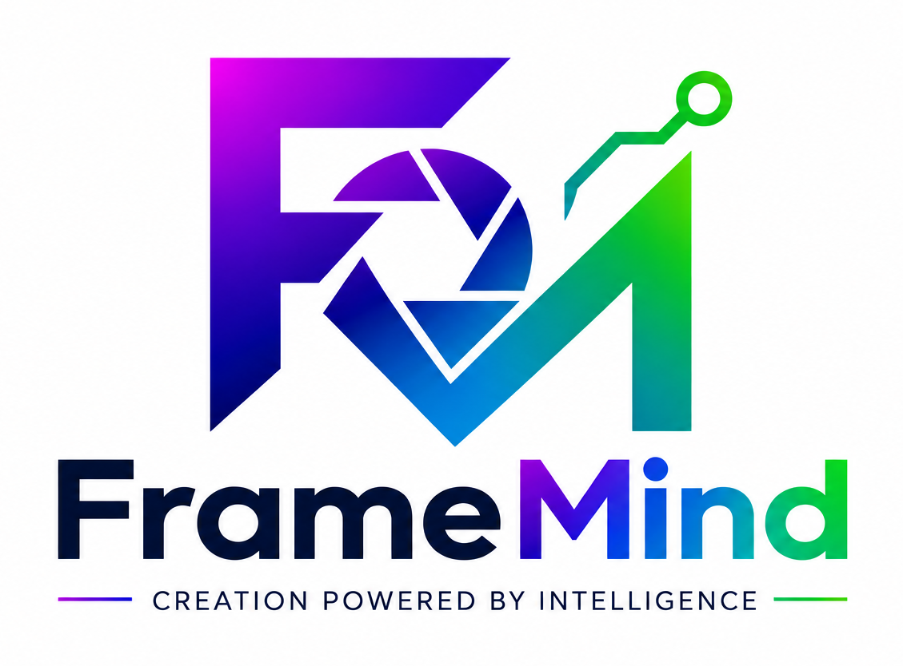

<div align="center">
  

  <h1>FrameMind Studio</h1>

  <p><strong>Select. Edit. Retouch.</strong></p>

  <p>A photo studio in the browser for the whole path from memory card to finished photos —<br />import, selection, edits, brush retouching and export in one window.<br />Retouching and edits are computed on your machine, not in the cloud.</p>

  <p>
    <a href="README.md"></a>
    <a href="README.en.md"></a>
  </p>
</div>

---

## Workflow

| | Step | What it does | Runs |
|---|---|---|---|
| 01 | **Import** | JPEG, PNG, WebP; RAW files (CR2, CR3, NEF, ARW, DNG…) use the embedded JPEG preview | locally |
| 02 | **Select** (AI culling) | sharpness, exposure, noise, composition, bursts and duplicates; K / R / X keys | locally · AI verdicts optional via Gemini |
| 03 | **Adjust** | histogram-based *Auto* plus light, colour, detail sliders and crop | locally |
| 04 | **Retouch** | brush or smart lasso: mark what should not be in the photo and the area is rebuilt from its surroundings | locally (ONNX models in the browser) |
| 05 | **Export** | JPEG / PNG, quality, size, watermark, whole set to a folder | locally |

## Retouching without an API

The models run in the browser via [ONNX Runtime Web](https://onnxruntime.ai/) in web workers. The photo never leaves the machine for retouching, and it needs no credits or API key. Each model downloads on first use from Hugging Face (URL pinned to a commit) and is stored in the browser's Cache Storage, so later sessions load it from disk and retouching works offline.

### Quality

| Option | What it does |
|---|---|
| **Automatic** (default) | small things (area up to ~120 × 120 px) go to the fast model, larger areas and people to the detailed one |
| **Fast** | always [MI-GAN](https://huggingface.co/andraniksargsyan/migan) · MIT · 28 MB — spots, dust, cables, small text |
| **Detailed** | always [LaMa](https://huggingface.co/Carve/LaMa-ONNX) · Apache-2.0 · 208 MB — large areas, people, cars |

Why two models: MI-GAN is instant but invents content on larger holes. On a match photo it replaced a removed head with glowing blobs; LaMa continued the blurred crowd behind it seamlessly.

### Brush

- **Size**, **edge hardness** (0–100 %) and **strength** (10–100 %). A soft brush blends the retouch into the photo at the edge; lower strength only softens an object (a wrinkle, a shadow). Settings are remembered.
- The result shows as soon as you let go; the full-resolution file is saved in the background.

### Smart lasso

- Click an object and [SAM 2.1](https://huggingface.co/onnx-community/sam2.1-hiera-tiny-ONNX) (Meta · Apache-2.0 · tiny int8 variant, 61 MB) returns its exact outline. Another click adds an object, **Alt+click** subtracts.
- Each click gives three extents — **Part / Object / Whole** — so a click on a hand can select the hand or the whole person.
- The selection is only shown; retouching happens on **Remove selection**.
- The model reads the photo once (encoder); every click after that takes tens of milliseconds. Measured in Node on an i5-11400H, single thread: 3.8 s to read the photo, 60–90 ms per click; the browser runs it multi-threaded.

### Keeping full resolution and quality

- The models work on a 512 × 512 square, so only the neighbourhood of the mask is cropped out — 2× the longer mask side for the fast model, 4× for the detailed one, because LaMa fills more convincingly with more context.
- **Only the pixels under the mask** are blended back with a soft edge. The rest of the photo stays at its original resolution; the only loss is the final JPEG save (quality 0.96).
- The mask is grown by a few pixels before inference, otherwise the model drags the object's outline into the hole.
- The filled area gets **grain** measured around the retouch. Without it the fill is smoother than the rest of the photo and gives the retouch away.
- The fast model benchmarks the GPU (WebGPU) and the CPU (WASM) while it loads and keeps the faster one; the detailed model uses the GPU when the browser offers it.

Controls: `[` / `]` brush size · mouse wheel zoom · space + drag pan · `0` fit · `Ctrl+Z` undo · hold **Compare** (or `\`) for the original.

## Gemini as an optional extra

Everything works without an API key except three extras:

- **AI verdicts in Select** — genre-aware (9 profiles: sports, portrait, wedding…), with short reasons and an optional photographer brief. Without a key, Select ends with local verdicts.
- **Lasso by description** — type e.g. "all tattoos"; Gemini finds where they are and the local SAM draws the exact outlines. A downscaled photo (longer side 1,536 px) is sent.
- **Edit with text** — describe the change in the Retouch panel and the photo is sent to Gemini.

In all three cases the photo (a downscaled preview in Select) goes to Google Gemini (US servers). The lasso-by-description and edit-with-text fields say so right next to them; in Select the step description states that AI verdicts go through Gemini. Add the key with the key button bottom left. It is session-only by default; persistent storage needs confirmation.

## Getting started

```bash
npm install
npm run dev        # http://localhost:3000
npm run build
npm run preview
npm run typecheck
npm run test:run
```

Multi-threaded WASM needs a cross-origin isolated page. The dev and preview servers send `Cross-Origin-Opener-Policy: same-origin` and `Cross-Origin-Embedder-Policy: credentialless`; `vercel.json` does the same in production. Without them retouching still works, single-threaded.

## What it is not

- no full RAW development — only the embedded preview
- no accounts, sync or cloud — project data lives in this browser only
- no server proxy for Gemini — the key stays in the user's browser
- large areas (e.g. a whole person) are not filled at full resolution: LaMa has a fixed 512 × 512 input and the crop is scaled down to it, so the larger the area, the softer the fill. Fine on a blurred background, visible on a sharp one

---

<div align="center">
  <sub>FrameMind Studio is part of <a href="https://framemind.cz">FrameMind</a>.</sub>
</div>
