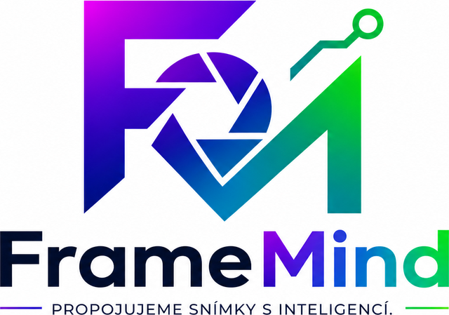

<div align="center">
  

  <h1>FrameMind Studio</h1>

  <p><strong>Propojujeme snímky s inteligencí.</strong></p>

  <p>AI fotostudio pro fotografy přímo v prohlížeči — žánrový AI culling, editor, retuš,<br />RAW konverze, klientské galerie a CRM v jedné aplikaci.</p>

  <p>
    <a href="README.md"></a>
    <a href="README.en.md"></a>
  </p>

  <p>
    
    
    
    
    
  </p>
</div>

---

## Proč FrameMind Studio

Velké culling nástroje (Aftershoot, Narrative, FilterPixel, Imagen) jsou jednoúčelové desktopové aplikace s předplatným. FrameMind Studio pokrývá celý workflow fotografa v prohlížeči — od importu přes výběr a úpravy až po předání klientovi — a v cullingu umí věci, které konkurence nemá:

- **Culling brief** — napíšeš záměr focení vlastními slovy a AI ho váží ve verdiktech
- **Vysvětlitelné verdikty** — u každé fotky důvod a rizika česky, ne jen skóre
- **Zdarma heuristická fáze** — ostrost, expozice, šum a série se počítají lokálně, bez API a offline

---

## AI Culling

Trojfázový výběr postavený na enginu FrameMind:

1. **Lokální heuristiky** (zdarma, ve web workeru) — Laplacianova ostrost, expozice, šum, kompozice, perceptual-hash detekce sérií a duplicit
2. **Rozpoznání žánru** — AI určí žánr celé sady ze tří náhledů; 9 žánrových profilů (sport, portrét, svatba, produkt, krajina, street, wildlife, reportáž, obecné) mění váhy i prahy — zavřené oči zabijí portrét, u sportu nevadí
3. **AI verdikty** — Gemini rozhodne keep / review / reject podle standardů daného žánru, se shrnutím, důvody a riziky; jisté rejecty se přeskakují

K tomu profi ovládání: klávesy **K / R / X** a šipky, sbalení sérií na reprezentanta s volbou „Tohle je vítěz", filtry podle verdiktu a jednorázové zahození rejectů.

## Další funkce

| Funkce | Popis |
|--------|-------|
| **Editor** | Manuální úpravy, filtry, ořez, vodoznak, historie undo/redo |
| **AI Autopilot** | Automatické vylepšení fotky + naučené tendence uživatele |
| **Retuš** | AI retuš promptem i maskou, odstranění objektů, výměna pozadí |
| **Batch Studio** | Hromadné úpravy a portrétní retuš celé série |
| **RAW Converter** | Konverze RAW (CR2, NEF, ARW…) přímo v prohlížeči |
| **YouTube miniatury** | Generátor thumbnailů se 4 šablonami a textovým overlayem |
| **AI Gallery** | Generování obrázků a správa AI assetů |
| **Projekty & klienti** | CRM — zakázky, klienti, timeline aktivit, klientské galerie |
| **PWA** | Instalovatelná z prohlížeče, offline-capable |
| **CZ / EN** | Kompletní dvojjazyčné rozhraní |

---

## Jak začít

```bash
npm install        # instalace závislostí
npm run dev        # development server (port 3000)
npm run build      # production build
npm run preview    # preview production buildu
```

### API klíč

1. Spusť aplikaci a vlož svůj Google Gemini API klíč v UI (tlačítko **API** v horní liště).
2. Klíč získáš zdarma v [Google AI Studiu](https://aistudio.google.com/app/apikey).
3. Klíč se ukládá pouze lokálně v prohlížeči.

> **Bezpečnost:** API klíče nikdy nepatří do repozitáře ani do buildů.

---

## Technologie

| Kategorie | Technologie |
|-----------|-------------|
| Framework | React 19 + TypeScript 5.8 |
| Build | Vite 6 |
| Stylování | Tailwind CSS 3 (FrameMind paleta z loga) |
| Animace | Framer Motion 11 |
| AI | Google Gemini API (`@google/genai`) |
| Culling | Vlastní engine — web worker heuristiky + žánrové profily |
| PWA | vite-plugin-pwa (Workbox) |

## Struktura projektu

```
App.tsx                  # Hlavní aplikační logika, routing, state
components/              # UI komponenty (lazy-loaded views + shared)
  CullingView.tsx        # AI culling board (žánry, série, K/R/X)
  ai/                    # AI Command Center
  editor/                # Editor sub-komponenty
contexts/                # React kontexty (Language, Project)
services/                # Gemini služby, uživatelský profil, API klíče
utils/                   # cullingEngine, cullingMetrics, imageProcessor…
workers/                 # Web workery (culling heuristiky, histogram)
public/                  # Loga, PWA ikony
```

---

<div align="center">
  <sub>FrameMind Studio je součást rodiny FrameMind — AI nástrojů pro fotografy.</sub>
</div>
