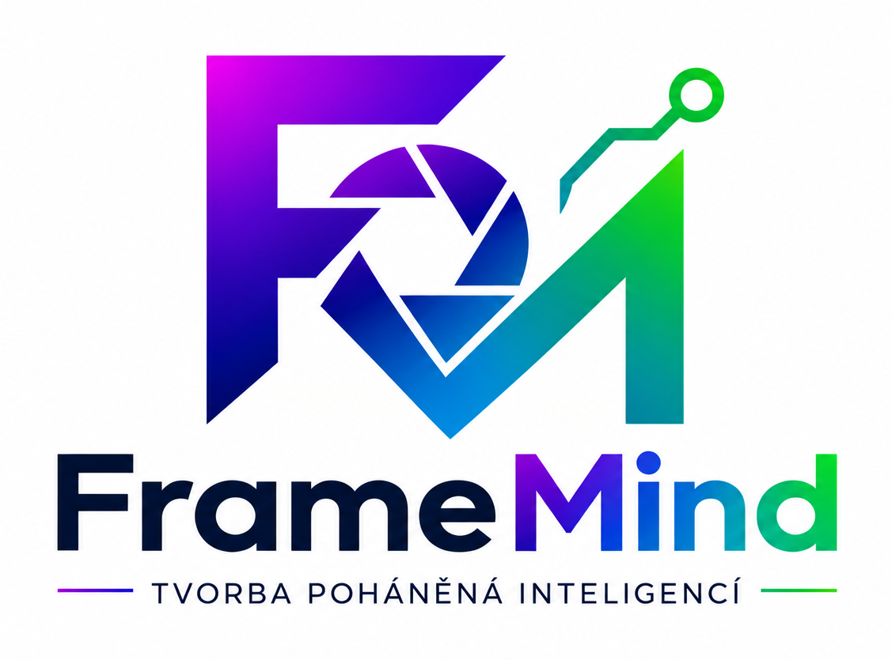

<div align="center">
  
  <h1>FrameMind Studio</h1>
  <p>Import, výběr, úpravy, retuš a export fotografií v prohlížeči.</p>
  <p><a href="README.md">Česky</a> · <a href="README.en.md">English</a> · <a href="LICENSE">MIT</a></p>
</div>

FrameMind Studio je open-source aplikace pro lokální provoz na vlastním počítači.
GitHub slouží pro zdrojový kód, zálohu a příspěvky; aplikaci nikam nenasazujeme.
Autorem a správcem je [Lukáš Drštička (Lukedaca)](https://github.com/Lukedaca).

**Culling je kompletně bez AI:** nemá Gemini, API klíč, detekční modely ani síťová volání.
Celé Studio zatím není plně offline: editor stále obsahuje dvě cloudové funkce
a modely retuše i písma se stahují. Přesný stav je v části [Připojení a data](#připojení-a-data).

## Spuštění lokálně

Potřebujete Git, Node.js 22 a npm. Node 22 používá také CI.

```bash
git clone https://github.com/Lukedaca/framemind-studio.git
cd framemind-studio
npm ci
npm run dev
```

Otevřete adresu vypsanou Vite, obvykle **http://127.0.0.1:3000**.
Dev i preview server naslouchají pouze na `127.0.0.1`.

```bash
npm run typecheck
npm run test:run
npm run build
npm run preview
```

Build vzniká v `dist/`; `preview` jej otevře na lokálním serveru, obvykle na portu 4173.
GitHub Actions provádí kontrolu typů, testy a build. Nic nenasazuje.
Automatické Vercel deploye při změnách v Gitu jsou vypnuté v `vercel.json`.

Pro culling musí prohlížeč podporovat Web Workers, `createImageBitmap` ve workeru
a `OffscreenCanvas`. Bez nich analýza ohlásí chybu; těžký výpočet se nepřesouvá
na hlavní vlákno. WebGPU retuše závisí na prohlížeči a ovladači; existuje také
WASM cesta. Dev i preview posílají hlavičky pro cross-origin izolaci.

## Co aplikace obsahuje

| Oblast | Současné chování |
|---|---|
| Import | JPEG, PNG, WebP; podporované RAW přípony se zpracují přes vložený JPEG náhled |
| Culling | Technické metriky, podobné záběry, ruční profily, filtry a volby K / R / X |
| Úpravy | Automatická úprava z histogramu, posuvníky a ořez |
| Lokální retuš | Štětec, klikací chytré laso, ONNX modely v prohlížeči |
| Export | JPEG / PNG, kvalita, velikost a vodoznak; jednotlivá fotka nebo sada |
| Projekty a klienti | Lokální CRM a náhled galerie v tomto prohlížeči |
| Rozhraní | Čeština a angličtina, PWA konfigurace |

Ukládání sady do složky používá File System Access API, pokud jej prohlížeč nabízí.
Jinak se jednotlivé soubory stahují přes prohlížeč.

## Culling bez AI

Analýza běží po jednom snímku v samostatném workeru. Měří náhled s delší stranou
nejvýše 768 px: rozložení jasu, přepaly, stíny, kontrast, indikátory detailu,
šumu a směrového rozmazání. EXIF se podle dostupnosti čte z původního souboru.
Profil vyberete ručně; mění váhy technického skóre, nikoli obsahovou analýzu.

- Skóre 0–100 má rozpis jednotlivých příspěvků. Není to pravděpodobnost kvality snímku.
- Podobnost využívá obrazovou strukturu, barvy a hashe. Série navíc používají čas pořízení
  nebo návaznost názvů souborů. Seskupení nemusí najít všechny podobné snímky,
  zejména u velkých sad s omezeným hledáním kandidátů.
- Automatika navrhuje pouze **ponechat** nebo **zkontrolovat**. Vyřazení je ruční.
- **K** = ponechat, **R** = zkontrolovat, **X** = vyřadit.
- Ruční volby zůstávají při opakované analýze i změně profilu.
- Výběr reprezentanta série nevyřadí ostatní snímky.
- Odebrání vyřazených vyžaduje potvrzení a odstraní je ze sady v aplikaci.
  Originály na disku se nemažou.
- Běh lze zastavit; hotová měření zůstávají k dispozici.

Náhledové metriky neposuzují oči, výraz, rozhodující moment, kompozici ani zaostření
na konkrétní subjekt. Směrový indikátor není důkaz pohybového rozmazání.
Prahy dosud nejsou kalibrované na reprezentativní sadě skutečných fotografií.

Z RAW se měří vložený JPEG, nikoli RAW senzorová data. Jeho zpracování ve fotoaparátu
ovlivňuje měření. Starší automatické výsledky vyžadují novou analýzu;
ruční rozhodnutí mají přednost.

## Lokální retuš

Štětcová retuš a klikací laso běží přes ONNX Runtime Web ve workerech.
Tyto cesty fotku neposílají do cloudového modelu a nevyžadují API klíč.

| Model | Úloha | Velikost podle souborů v konfiguraci |
|---|---|---|
| MI-GAN | Rychlá retuš | přibližně 28 MB |
| LaMa | Detailní retuš | přibližně 208 MB |
| SAM 2.1 tiny int8 | Masky pro klikací laso | přibližně 62 MB |

Volba **Automaticky** používá MI-GAN pro plochu masky do 14 400 pixelů
v rozměrech původní fotky a LaMa pro větší plochu. Neprovádí rozpoznávání lidí.
Rychlý model se připravuje při otevření retuše; další modely se načítají podle potřeby.

Retuš zpracuje okolí masky na vstupu 512 × 512 a výsledek prolne zpět do fotky.
Rozměry plátna zůstávají zachované, detail doplněné velké oblasti je ale omezený
rozlišením modelu. Uložení upravené fotky do JPEG ji znovu komprimuje.
Laso poskytuje kandidátní masky; přesný obrys ani kvalita doplnění nejsou zaručené.
Výkon závisí na zařízení, prohlížeči a zvolené výpočetní cestě.

## Připojení a data

| Funkce nebo zdroj | Připojení / uložení |
|---|---|
| Culling | Žádná síťová volání, modely ani klíče |
| Instalace balíčků | `npm ci` stahuje závislosti z npm |
| Retuš a klikací laso | Modely se načítají z Hugging Face, URL jsou připnuté na commit; cache je v prohlížeči |
| Písmo rozhraní | Google Fonts; PWA má pravidla pro jejich cache |
| Laso podle popisu | Stále používá Gemini a posílá zmenšenou fotografii, delší strana nejvýše 1 536 px |
| Úprava textem | Stále posílá fotografii do Gemini |
| Projekty a klienti | JSON v `localStorage`, bez synchronizace mezi zařízeními |

Dvě Gemini funkce patří pouze do editoru a vyžadují vlastní klíč. Výchozí uložení
klíče je na relaci; trvalé uložení vyžaduje potvrzení. Nejsou součástí cullingu.
Klíč nepatří do repozitáře ani do buildu.

Cache může umožnit další použití modelů bez internetu, ale její dostupnost a kvóta
nejsou zaručené. PWA konfigurace sama nedokazuje úplný offline provoz všech funkcí.

`localStorage` **není záloha fotografií**: JSON neobnoví objekty `File` ani původní
`blob:` URL po nové relaci. Originály uchovejte na disku a výsledky exportujte.
Smazání dat prohlížeče odstraní místní CRM; změna hostu nebo portu používá jiné úložiště.
Náhled galerie není služba pro veřejné hostování fotografií.

## Omezení a ověření

- RAW import extrahuje náhled; nejde o demosaicing ani plné vyvolání RAW.
  Soubor bez použitelného vloženého JPEG nemusí jít importovat.
- Nejsou zde uživatelské účty, serverové úložiště ani synchronizace.
- Testy cullingu a prohlížečový smoke ověřují technické chování na syntetických datech.
  Neprokazují fotografickou kvalitu ani rychlost na velké skutečné RAW sadě.
- Kompletní ověření retuše ve všech prohlížečích a na všech GPU nebylo provedeno.

Historický audit a záznam implementace: [docs/culling-local-audit.md](docs/culling-local-audit.md).
Starší soubory v `docs/plans/` jsou návrhy, nikoli potvrzení současných funkcí.

## Příspěvky a licence

Postup pro bug reporty, změny a ověření: [CONTRIBUTING.md](CONTRIBUTING.md).
Správce: [CONTRIBUTORS.md](CONTRIBUTORS.md).
Zdrojový kód je pod [licencí MIT](LICENSE). Závislosti a modely mají vlastní licence;
odkazy na použité modely jsou v `utils/inpaintModels.ts` a `utils/segmentModel.ts`.
